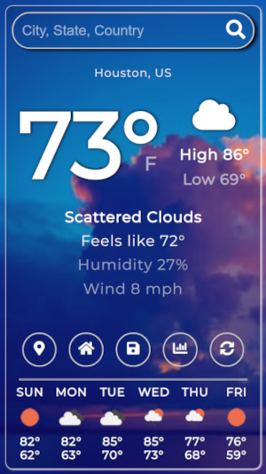

# Responsive Weather App

Responsive mobile-first weather app powered by [Open Weather API](https://openweathermap.org/api).




## Features

- Search for the weather by entering the name of a City, State Country or Zip Code
- Get weather for current location
- Save a location
- Switch between metric and imperial units for weather
- Six day weather forecast
- Dynamic icons and background based on the weather


## Requirements

- Open Weather API Key


## Deploy on Netlify

Link your GitHub repository with Netlify and add the Open Weather API Key as an environment variable with the key
WEATHER_API_KEY.

You can test out changes locally before deploying using the Netlify CLI
```
npm i netlify-cli -g
netlify-cli link
netlify dev
```
